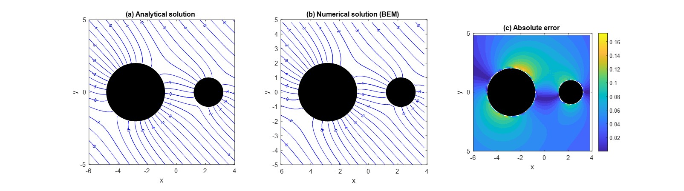

# BEPO2D - BEM Potential Flow Solver

This repository provides a Boundary Element Method (BEM) implementation for solving 2D potential flow problems.

## Features
- FORTRAN-based solver for potential flow
- MATLAB scripts for visualization
- Example cases for engineering education

## Applications
- Computational mechanics
- Engineering mathematics teaching
- Potential flow simulation

## Academic Background
This project is part of my PhD research in computational mechanics, focusing on analytical and numerical methods such as the Boundary Element Method.

## Future Development
- AI-assisted code analysis
- Automated visualization workflow
- Improved documentation for students and researchers

## Demo Result

## Author
Yen-Ting Chou
